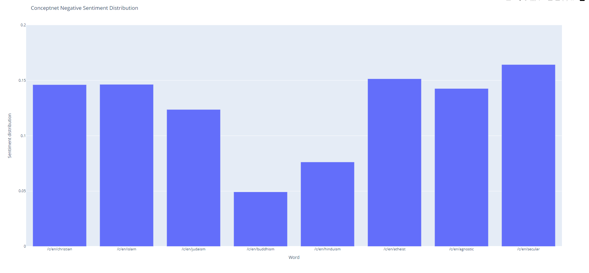

# Word Embeddings NLP 
__To run__
- We do not need to train models again since they're included here
- pip install gensim wefe
- python main.py

## Embeddings
The two variations of embeddings I used were Continuous bag of words and Skip-gram models trained by the Gensim library. What I initially noticed is the time it took to train such small word embeddings. The outputs of each embedding trained on 3000 wikipedia articles took 30 minutes to train and only came out to about 17mb. Comparing this to the pre-trained models I downloaded, I cannot imagine how much time it would take for embeddings of 1GB+ to be trained by similar methods. The CBOW and SG models that I trained only differed in the setting SG=1/0 being how they are trained. Otherwise, the parameters are the same. The queries and their responses from each model are below. For similar words, I tried finding bias in my own trained models which showed slightly in the CBOW model when similar words to 'gay' were output. Obviously the larger, pre trained models were much more accurate, but it was interesting to see that the CBOW model that I trained was confidently wrong often which we see in many consumer models. It confidently gave me incorrect analogies and similar words. Otherwise, much of the output was expected.

__Results__
Words similar to 'piano':
- CBOW: [('instrument', 0.9151349663734436), ('performed', 0.9009426832199097), ('dance', 0.8888988494873047), ('character', 0.886135458946228), ('romantic', 0.8851908445358276), ('plays', 0.8816924095153809), ('comedies', 0.8808860182762146), ('stringed', 0.8759132623672485), ('sonatas', 0.8744109869003296), ('quartet', 0.8739439249038696)]   
- SG: [('concertos', 0.9160712957382202), ('instrument', 0.9046199321746826), ('saxophone', 0.8973535299301147), ('violin', 0.8927489519119263), ('flute', 0.8566170334815979), ('harpsichord', 0.8497025966644287), ('beethoven', 0.8479941487312317), ('haydn', 0.8478628993034363), ('symphonies', 0.8293575048446655), ('oboe', 0.8280911445617676)]  
- Google News: [('violin', 0.8228187561035156), ('cello', 0.8113837242126465), ('clarinet', 0.7756922841072083), ('saxophone', 0.7755720019340515), ('pianist', 0.7373092174530029), ('trombone', 0.7362412810325623), ('harpsichord', 0.73116135597229), ('pianos', 0.7288245558738708), ('guitar', 0.7262812852859497), ('classical_guitar', 0.7254635095596313)]
- FastText: [('violin', 0.7523839473724365), ('pianos', 0.734627902507782), ('cello', 0.7224264740943909), ('guitar', 0.7157374024391174), ('four-hands', 0.7102022171020508), ('Piano', 0.7065632343292236), ('pianoforte', 0.7058168649673462), ('pianist', 0.6877458691596985), ('harpsichord', 0.6804825663566589), ('saxophone', 0.6799320578575134)]

Words similar to 'gay':
- CBOW: [('assassins', 0.9500625133514404), ('dislike', 0.9412105679512024), ('transgender', 0.9401026368141174), ('flaws', 0.9393025636672974), ('cough', 0.9362258911132812), ('advertisement', 0.9346796870231628), ('listen', 0.9339470863342285), ('comments', 0.9324082732200623), ('plumbers', 0.9311125874519348), ('bisexuality', 0.9304359555244446)]
- SG: [('lesbian', 0.906441330909729), ('bisexual', 0.883491039276123), ('lgbt', 0.8644359707832336), ('homosexual', 0.8288567066192627), ('assassins', 0.8113208413124084), ('naturalized', 0.8086944222450256), ('nonviolence', 0.8083668947219849), ('transgender', 0.8039828538894653), ('appeal', 0.801505982875824), ('journalists', 0.7997068166732788)]
- Google News: [('homosexual', 0.8145633339881897), ('lesbian', 0.8117855787277222), ('gays', 0.7874494194984436), ('LGBT', 0.7650426626205444), ('homosexuals', 0.756274402141571), ('lesbians', 0.7516926527023315), ('transgender', 0.7355296015739441), ('GLBT', 0.7310077548027039), ('gay_lesbian', 0.7307642102241516), ('openly_gay', 0.7280736565589905)]
- FastText: [('homosexual', 0.8233118653297424), ('lesbian', 0.794991672039032), ('heterosexual', 0.7644851803779602), ('queer', 0.7476610541343689), ('non-gay', 0.7415070533752441), ('gays', 0.7365478277206421), ('bisexual', 0.7213318943977356), ('LGBT', 0.7187954783439636), ('gay-', 0.7146794199943542), ('Gay', 0.7099630832672119)]

Words similar to 'moon':
- CBOW: [('sun', 0.9402700066566467), ('planet', 0.9394228458404541), ('neptune', 0.9256196022033691), ('jupiter', 0.9200175404548645), ('comet', 0.9191659092903137), ('venus', 0.9140589237213135), ('mars', 0.9080880284309387), ('saturn', 0.8831305503845215), ('orbit', 0.8808466196060181), ('uranus', 0.8764963746070862)]
- SG: [('uranus', 0.8310413956642151), ('jupiter', 0.807338297367096), ('saturn', 0.8071185350418091), ('io', 0.8012782335281372), ('lunar', 0.8008726835250854), ('neptune', 
0.7913227081298828), ('titan', 0.7904513478279114), ('planet', 0.7901027798652649), ('pluto', 0.7885565161705017), ('voyager', 0.787341296672821)]
- Google News: [('lunar', 0.6732722520828247), ('lunar_surface', 0.6433477401733398), ('waning_gibbous', 0.6095104813575745), ('Mars', 0.5964548587799072), ('waxing_gibbous', 0.589842677116394), ('manned_lunar_landing', 0.576456606388092), ('outer_space', 0.5709885358810425), ('lunar_landing', 0.5696337223052979), ('Moon', 0.5668864250183105), 
('moon_bahn_kee', 0.5659952759742737)]
- FastText: [('lunar', 0.7450747489929199), ('Moon', 0.734407365322113), ('moons', 0.6950199604034424), ('sun', 0.6499733328819275), ('moon-', 0.61912602186203), ('Lysithea', 0.6090036034584045), ('gibbous', 0.6080746054649353), ('Lunar', 0.606916606426239), ('moon.', 0.6000717282295227), ('moonlight', 0.5975298285484314)]

Woman + King - Man analogy:
- CBOW: [('marriage', 0.8555112481117249)]
- SG: [('prince', 0.5838475823402405)]
- Google News: [('queen', 0.7118193507194519)]
- FastText: [('queen', 0.751591145992279)]

Man/Woman similarity:
- CBOW: 0.8757303357124329
- SG: 0.769716203212738
- Google News: 0.7664012312889099
- FastText: 0.8164522647857666

## Bias
I extended the WEAT model from WEFE. In doing so, I reran the calculations 

## Classification

## Reflection